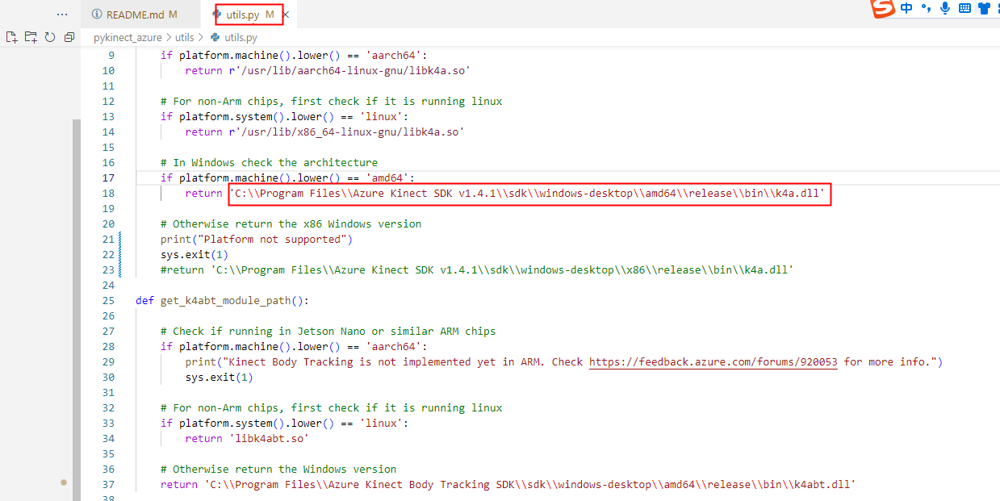

# pyKinectAzure
Notes:
This repository fork from https://github.com/ibaiGorordo/pyKinectAzure . Simply replace the  Orbbec SDK K4a Wrapper libraries,This will allow you to use Orbbec Femto Mega and Femto Bolt just like Azure Kinect, without needing to change any Python interfaces.


[](https://pypi.org/project/pykinect-azure/)


Python 3 library for the Azure Kinect DK sensor-SDK.

## Similar solutions
Part of the ideas in this repository are taken from following repositories:
* [pyk4a](https://github.com/etiennedub/pyk4a): Really nice and clean Python3 wrapper for the Kinect Azure SDK.

* [Azure-Kinect-Python](https://github.com/hexops/Azure-Kinect-Python): More complete library using ctypes as in this repository, however, examples about how to use the library are missing and the library is harder to use.

The objective of this repository is to combine the strong points of both repositories by creating a easy to use library that allows the use of most of the functions of the Kinect Azure. Also, to create sample programs to showcase the uses of the library

## Prerequisites
* [Orbbec SDK K4a Wrapper](/orbbecK4aWrapper/readme.md): Replace the corresponding libraries of Azure Kinect Sensor SDK with the libraries in the K4a Wrapper directory.
* **ctypes**: required to read the library.
* **numpy**: required for the matrix calculations
* **opencv-python**: Required for the image transformations and visualization.

## Installation
```commandline
pip install pykinect_azure
```

## How to use this library

* The library has **been tested in Windows 10 and Ubuntu 20.04** with the Kinect Azure SDK 1.4.0 and 1.4.1, it should also work with other operating systems.

  - **Windows:** When using the pyKinectAzure class, it requires the **path to the k4a.dll module**, make sure that the path is the correct one for your Orbbec SDK K4a Wrapper version.  the path (**module_path**) is set to Orbbec SDK K4a Wrapper windows lib path. For Example,If you download the code to the C drive,Replace the paths in the following image to  ```C:\\pyKinectAzure\\orbbecK4aWrapper\\lib\\windows_x64\\k4a.dll```. 
  
  

Notes: 
   After modify utils.py,set Orbbec SDK K4a Wrapper lib path, then in the root path, compile and install,using the follow script:  1、python setup.py build 2、python setup.py install

  - **Linux:** When using the pyKinectAzure class, it requires the **path to the k4a.so module**, make sure that the path is the correct one for your Orbbec SDK K4a Wrapper version. First, copy [Orbbec SDK K4a Wrapper linux lib](/orbbecK4aWrapper/lib/linux_x64/*) to [the system path](/usr/lib/x86_64-linux-gnu), then using Linux set **module_path** to  ```/usr/lib/x86_64-linux-gnu/libk4a.so```.
  
   - **TODO：Arm64(Nvidia Orin nano)
 

* The **pyKinectAzure** class is a wrapper around the **_k4a.py** module to make the library more understandable. However, the **pyKinectAzure** class still contains few methods from the Kinect Azure SDK

* The **_k4a.py** module already contains all the methods in the Kinect Azure SDK. So, for more advanced of the Kinect Azure SDK check the **_k4a.py** module.

## Examples

For an example on how to obtain and visualize the depth data from the Azure Kinect DK check the **exampleDepthImageOpenCV.py** script.
```
git clone https://github.com/orbbec/pyKinectAzure.git
cd pyKinectAzure/examples
python exampleDepthImageOpenCV.py
```

Also, there is an example to obtain and visualize the smooth depth from the Azure Kinect DK check the **exampleSmoothDepthImageOpenCV.py** script.
```
python exampleSmoothDepthImageOpenCV.py
```
> note: when you are dealing on the linux platform, please insure that the user have permission to the usb devices, or always execute under the root permission by adding `sudo` ahead.


## Contribution

Feel free to send pull requests.

Bug reports are also appreciated. Please include as much details as possible.

## TODO:

### Wrappers for the Kinect Azure data
- [x] Create wrapper to read depth images.
- [x] Create wrapper to read Infrared images.
- [x] Create wrapper to read IMU data.
- [x] Create function to convert image buffer to image depending on the image type.
- [x] Create wrapper to transform depth image to color image.
- [x] Create wrapper to transform depth image to 3D point cloud.
- [x] Create funtion to visualize 3D point cloud.

### Create examples
- [x] Example to visualize depth images.
- [x] Example to visualize passive IR images.
- [x] Example to plot IMU data.
- [x] Example to visualize Depth as color image.
- [x] Example to overlay depth color with alpha over real image.
- [x] Example to visualize 3D point cloud

### Body tracking
- [x] Create library for the body tracking SDK similar the same way as the current library.
- [x] Combine image and skeleton data.
- [ ] Generate 3D skeleton visualization.

### Future ideas
- [ ] Run Deep Learning models on Kinect data (Openpose 3D skeleton, semantic segmentation with depth, monocular depth estimation validation)
- [ ] Track passive infrared marker for motion capture analysis
